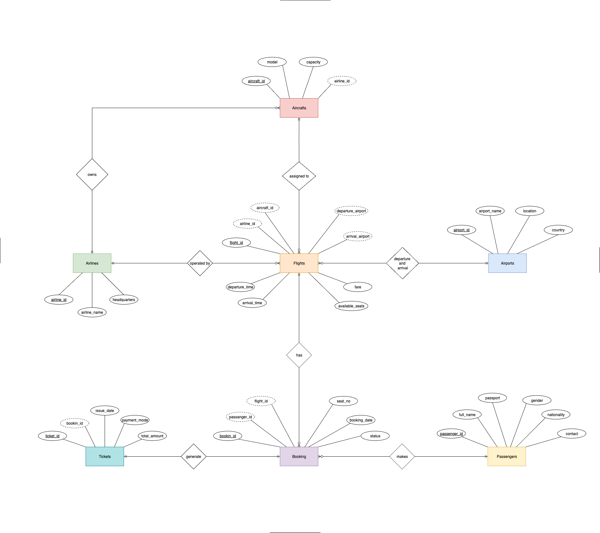
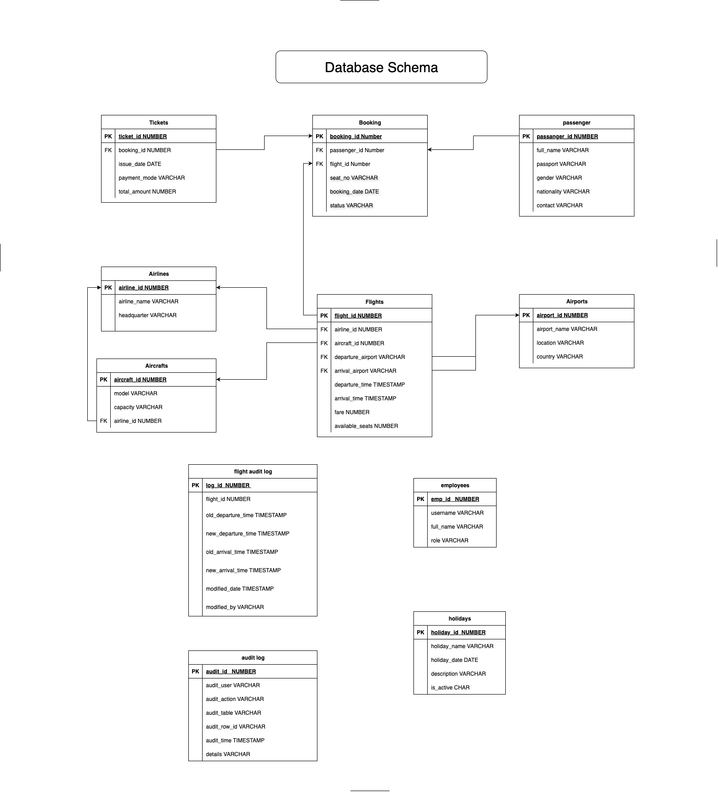

# Airport-Airline_PLSQL_System

# PL/SQL Oracle Database Capstone Project

**ID:** 27928     
**Name:** Eric BIKORIMANA 

**Course Details:**  
**Course:** INSY 8311 - Database Development with PL/SQL   
**University:** Adventist University of Central Africa   
**Academic Year:** 2025-2026, SEM I   
**Group:** D on  Thursday   
**Instructor:** Eric Maniraguha   

## Requirement

| Tool | Category | Primary Purpose | Benefit |
| :--- | :--- | :--- | :--- |
| **Oracle 23c Database** | Database | The core database engine (use the **Free - Developer Release**). | Provides the latest features like JSON Relational Duality, and the target environment for PL/SQL execution. |
| **Docker** | Virtualization/Containerization | Packages the database and its dependencies into a lightweight, portable container. | **Quick setup** of a consistent local Oracle environment (e.g., using the `container-registry.oracle.com/database/free` image).  |
| **SQL Developer** | IDE/GUI Tool | Graphical tool for database administration, development, and debugging. | **Best-in-class PL/SQL Debugger** and easy schema browsing. |
| **VS Code** | Code Editor/IDE | Lightweight, highly extensible source code editor. | Excellent for writing and version-controlling PL/SQL scripts, using extensions like **Oracle Developer Tools for VS Code**. |
| **draw.io (or diagrams.net)** | Diagramming | Cloud-based and desktop tool for creating visual diagrams. | **Visualizing database schemas** (ERDs), process flows, and PL/SQL package dependencies. |
| **MS PowerPoint** | Presentation | Tool for creating slide presentations. | **Documenting and presenting** PL/SQL designs, architectural diagrams (often generated from draw.io), and training materials. |

## Project Details:

### **Title: Airport and Airline Management System**

### Project Overview

The **Airport and Airline Management System** aims to design and implement an integrated PL/SQL-based system to manage airport and airlines operation including flights scheduling, passenger bookings, aircrafts details, and ticketing. It ensures data consistency, automates core airport processes, and provides accurate information retrieval for management and passengers.

### Problem statement

Airport operations require managing complex relationships between flights, passengers, aircraft, and bookings, which manual systems cannot efficiently handle, leading to errors and data inconsistency.

## Project Objectives

* Design a normalized relational database for airport operations
* Implement comprehensive PL/SQL components (packages, procedures, functions, triggers)
* Automate business processes using triggers and stored procedures

### ER Diagram

This Entity-Relationship (ER) Diagram represents the conceptual data model for an Airport and Airline Management System. The system is designed to track and manage all aspects of air travel, including airlines, aircraft, flights, airports, bookings, passengers, and tickets. 
[Here](docs/data_dict.md) for more description

### Database schema

This diagram represents the Physical Database Schema for the Airport and Airline Management System, which is implemented using an Oracle database and managed extensively via PL/SQL stored procedures, functions, and triggers. [Here](docs/data_dict.md) for data dictionary.

**Author:** BIKORIMANA Eric    
<!-- **Date:** 2025-12-18 -->
